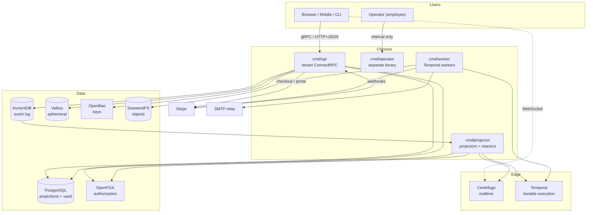
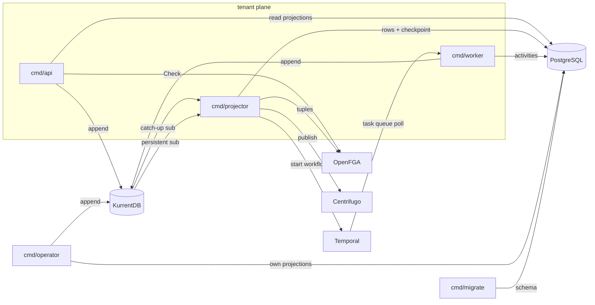
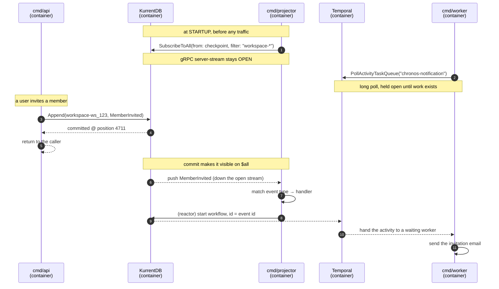
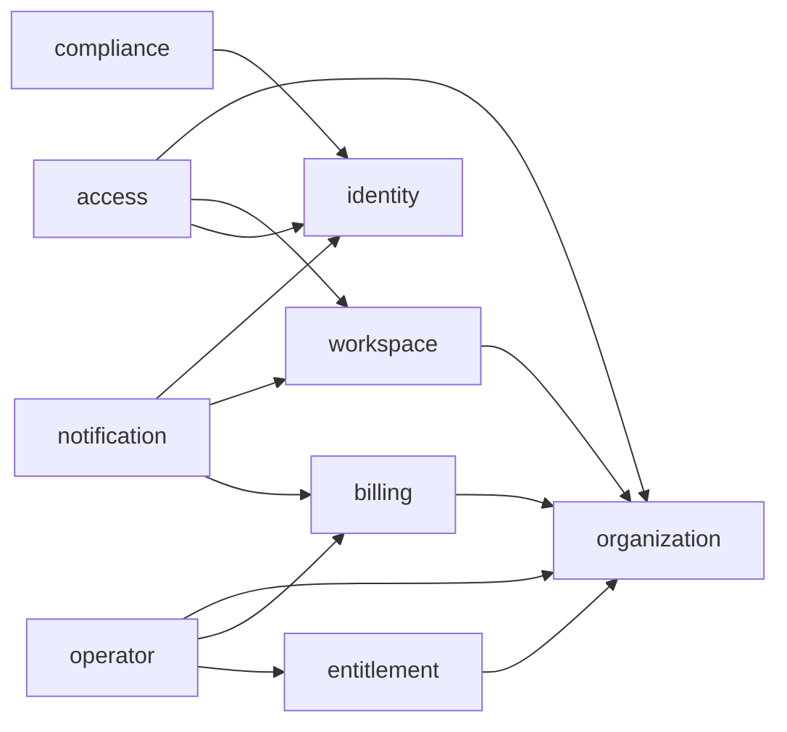
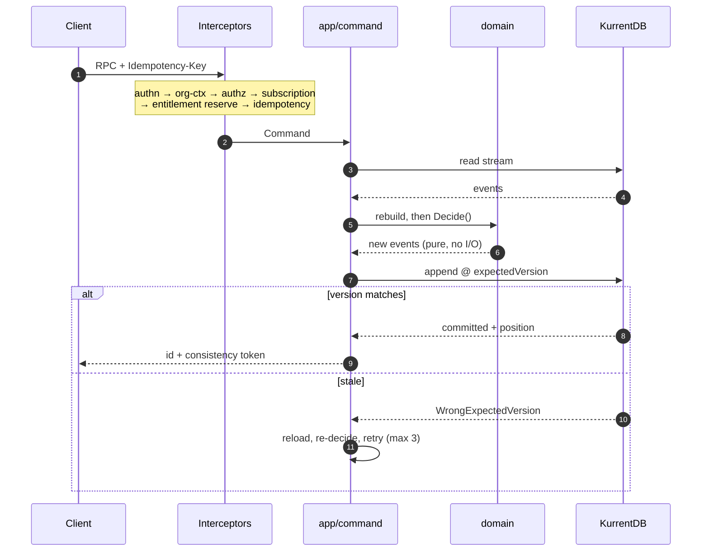
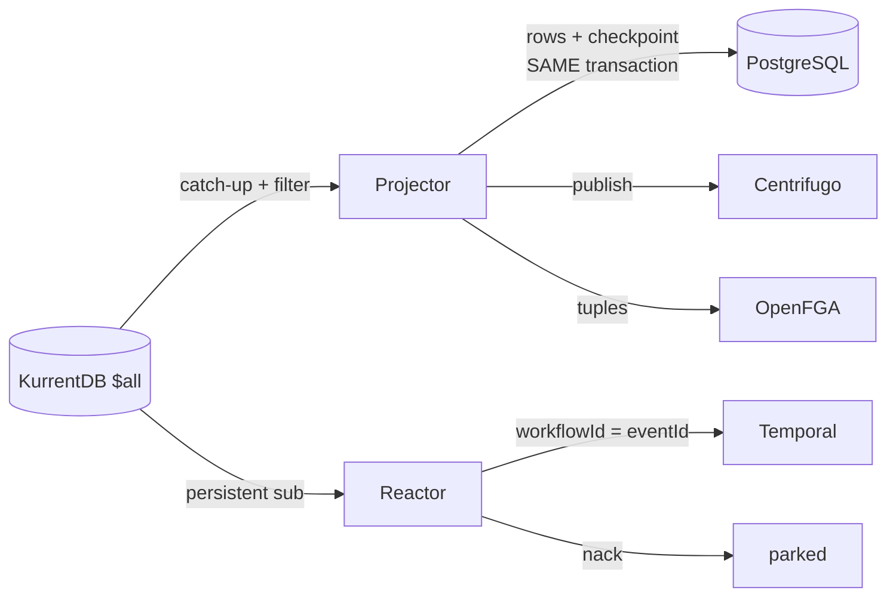
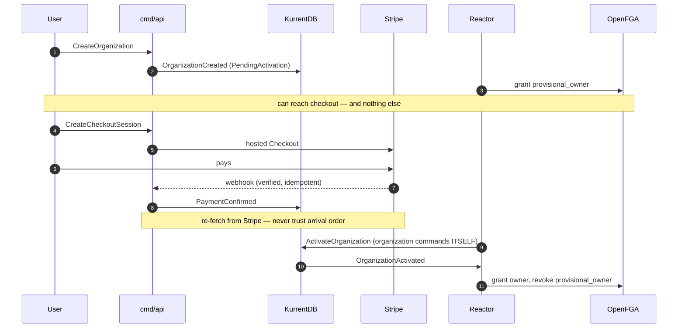
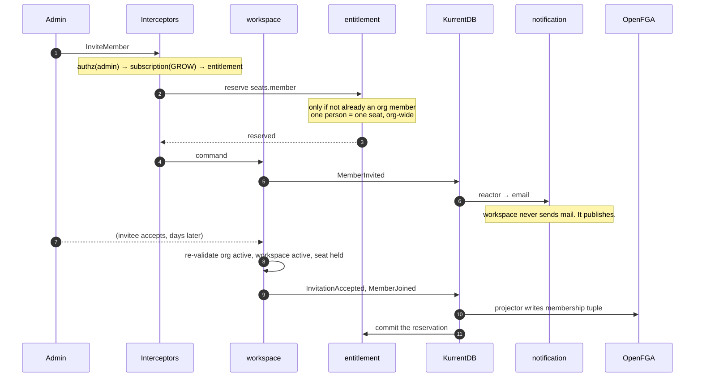
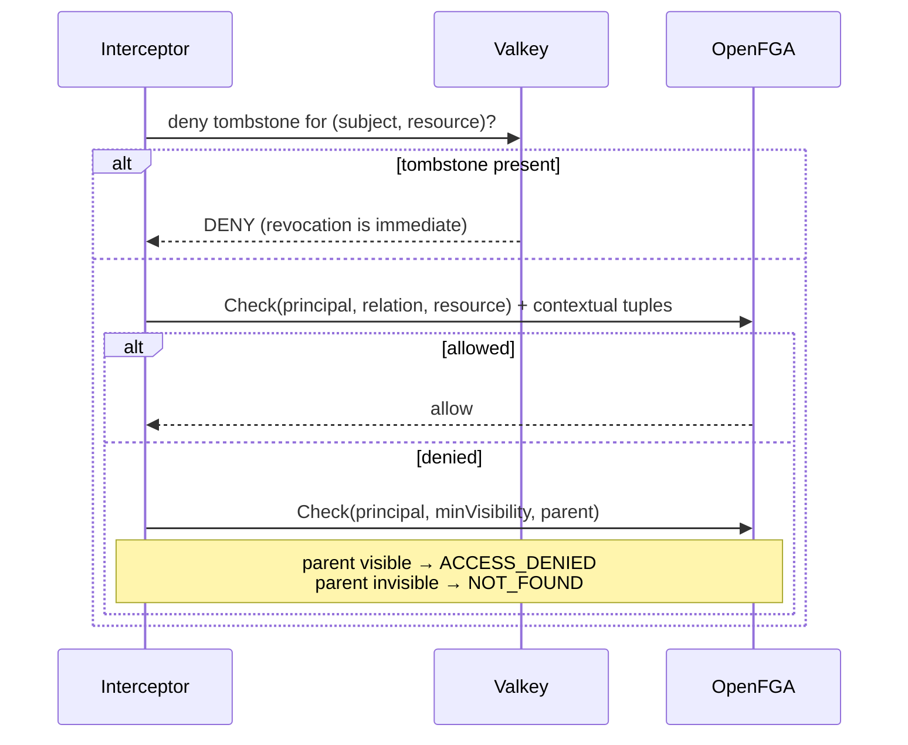
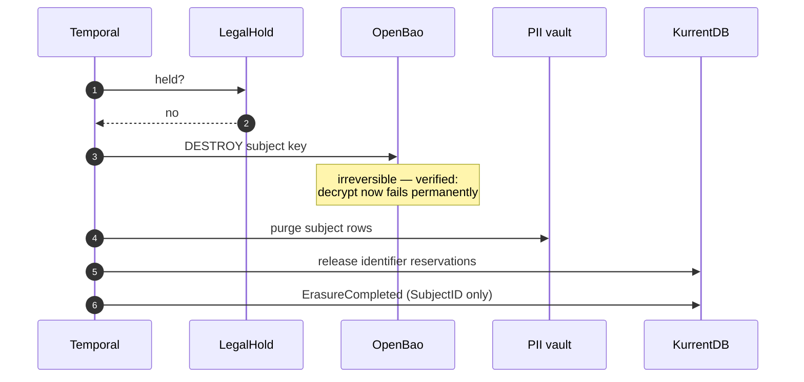

# Solution Architecture

The integration view: how the pieces fit, what flows where, and what is
guaranteed. Every claim here is decided in [DECISIONS.md](DECISIONS.md), detailed
in a [domain spec](domains/), or verified in [evidence/](evidence/).

**Read this first, then [CONVENTIONS.md](CONVENTIONS.md) before writing code.**

---

## 1. What this is

A multi-tenant SaaS platform. An **organization** is the commercial boundary —
one contract, one subscription, one owner. Beneath it, **workspaces** hold
members and teams, and a Drive-shaped **access engine** governs who can reach
what.

It is an **event-sourced, CQRS, realtime-first modular monolith**. Scope
terminates at workspace + teams + member invitations; feature verticals inside a
workspace are out of scope (FEATURES.md).

Five properties drive every decision below:

| Property | Consequence |
| --- | --- |
| **Event-sourced** | KurrentDB is truth; Postgres is derived and disposable |
| **CQRS** | writes and reads share no code and no store |
| **Realtime-first** | every projection publishes; clients never poll |
| **Erasable** | no personal data in events, logs or projections |
| **Multi-tenant** | four independent isolation layers, deny by default |

---

## 2. System context



**The tenant API never writes a projection, and the projector never serves a
request.** That separation is the architecture.

---

## 3. Processes

| Binary | Responsibility | Scales on |
| --- | --- | --- |
| `cmd/api` | tenant RPC — gRPC + HTTP/JSON on **one port** (ADR-007) | request volume |
| `cmd/operator` | back-office — **separate binary, internal network** (ADR-024) | rarely |
| `cmd/projector` | catch-up projectors + persistent-subscription reactors | event volume |
| `cmd/worker` | Temporal workflow and activity workers | workflow volume |
| `cmd/migrate` | Atlas migrations | deploy-time |

`cmd/api` **must not link** `internal/operator` — asserted against the built
binary. A cross-tenant capability is not reachable from the public surface
because it is not in the running process.

### 3.1 How the processes communicate — they don't

> **No Chronos binary ever makes an RPC to another Chronos binary.**
> The event log is the bus.

This is the property that makes five entrypoints cheap rather than a
distributed system. There is no service discovery, no retry-between-services, no
partial-failure matrix between our own processes — because there are no calls
between them.



Every arrow is a process talking to **infrastructure**, never to a sibling.
`cmd/api` does not know `cmd/projector` exists; it appends an event and returns.

### 3.2 System-initiated commands skip the request pipeline — deliberately

A Temporal activity that expires an invitation, or an operator suspending an
organization, needs to *write*. Neither calls the API over HTTP: they are the
same codebase, so they load the aggregate and append directly.

That is correct rather than a shortcut. The enforcement pipeline (ADR-021) gates
**a human's authority** — authn, authz, subscription state, entitlement. A
scheduled expiry has no principal to authorise, so running it through gates
designed for one would mean inventing a fake session.

Instead, system-initiated commands:

- carry a `SystemPrincipal` with the workflow or operator identity as the actor,
- are **audited** with that actor (operator.md §5),
- are **idempotent** via a deterministic event id (EVENT-SOURCING §3),
- and still honour every **domain invariant**, because they run the same
  aggregate code. There is no privileged back-channel that skips domain rules.

### 3.3 Scaling — and the one asymmetry that matters

| Process | Replicas | Why |
| --- | --- | --- |
| `cmd/api` | **N** | stateless; scale on request volume |
| `cmd/worker` | **N** | Temporal task queues are competing consumers by design |
| `cmd/projector` — **projectors** | **1 per projection** | ⚠ see below |
| `cmd/projector` — **reactors** | **N** | persistent subscriptions are competing consumers |
| `cmd/operator` | 1–2 | negligible traffic |
| `cmd/migrate` | run-once | deploy step |

> **⚠ A projector is a single writer, and this is not a tuning choice.**
>
> Catch-up subscriptions hold the checkpoint **client-side** (ADR-019). Two
> instances running the same projector would both read from the same position,
> both write the same rows, and race on the checkpoint — silently
> double-processing and then losing position on restart.

Leadership is a **Postgres advisory lock** per projector name: an instance that
cannot take the lock stays idle and warm, ready to take over. No new
infrastructure, and the lock releases automatically if the holder dies.

**Reactors are the opposite.** They use persistent subscriptions, where
KurrentDB holds the checkpoint and hands work to competing consumers with
ack/nack. They scale horizontally with no coordination — which is precisely why
the projector/reactor split follows the subscription type (CONVENTIONS §1.4).

Throughput therefore scales by **adding projections**, not by adding instances
of one. A single projection that cannot keep up is split, not replicated.

### 3.4 Worked example: how a projector learns about an event

"No network hop" means **no process calls another process**. It does *not* mean
no network — every process holds a long-lived connection to shared
infrastructure. **KurrentDB and Temporal are the message bus.**

Nobody is notified. Subscribers **hold an open stream** and the server pushes
down it.



Three things follow, and they are the answer to "how do they know each other?"

**1. They don't know each other. They know the infrastructure address.**
Every container resolves `kurrentdb:2113` and `temporal:7233` on the shared
Docker network — that is the *only* shared knowledge. `cmd/api` has no
configuration naming `cmd/projector`, and there is no endpoint on the projector
to call. Scaling the projector to three replicas changes nothing about `cmd/api`.

**2. "What am I looking for" is compiled in, not discovered.**
A projector registers its subscription filter and its event handlers at startup:

```
subscribe $all
  from:   my stored checkpoint
  filter: stream prefix in {workspace-, organization-}, excluding $-system streams
  handle: MemberInvited, MemberJoined, MemberRemoved, …
```

Everything else streaming past is ignored. There is no registry, no discovery,
no negotiation — adding a projector means deploying a binary that subscribes.

**3. Nothing is lost while a subscriber is down.**
This is what makes push-free coordination safe. If the projector container is
stopped for an hour, `cmd/api` keeps appending; the events sit in KurrentDB. On
restart the projector resumes **from its stored checkpoint** and catches up at
disk speed. Temporal behaves the same way: activities queue until a worker polls.

A message bus that dropped messages when a consumer was offline would make this
architecture unworkable. A durable log makes the consumer's uptime irrelevant to
the producer's correctness.

---

### 3.5 Startup order and failure interaction

Ordering matters only at deploy time:

1. `cmd/migrate` — schema first, always
2. everything else, in any order

At runtime the processes are independent:

- **`cmd/api` down** → projectors keep projecting, workers keep working. Writes
  stop; the read model stays current with what was already appended.
- **`cmd/projector` down** → the API still serves reads (stale) and still
  accepts writes. Nothing is lost; the projector resumes from its checkpoint.
  The visible symptom is staleness, which is why access-projector lag has an
  SLO (access.md §6.3).
- **`cmd/worker` down** → workflows queue in Temporal and resume. Nothing is
  dropped.

No process failure cascades, because none of them is on another's request path.

---

## 4. Layers

```
   ┌──────────────────────────────────────────────────────────┐
   │  api/          Connect handlers · proto ↔ domain mapping │
   │  adapter/      KurrentDB · Postgres · OpenFGA · Stripe   │
   └───────────────────────────┬──────────────────────────────┘
                               │ implements ports, depends inward
   ┌───────────────────────────▼──────────────────────────────┐
   │  app/command/    load → decide → append                  │
   │  app/query/      read a projection                       │
   │                  ports declared HERE, by the consumer    │
   └───────────────────────────┬──────────────────────────────┘
                               │
   ┌───────────────────────────▼──────────────────────────────┐
   │  domain/       aggregates · invariants · events          │
   │                stdlib + platform only.  NO I/O.          │
   └───────────────────────────┬──────────────────────────────┘
                               │
   ┌───────────────────────────▼──────────────────────────────┐
   │  platform/     generic primitives + port interfaces      │
   │                imports NO module, ever                   │
   └──────────────────────────────────────────────────────────┘
```

The rule that keeps it honest: **`domain/` may not import `encoding/json`, `net/http`,
a driver, or a generated protobuf package.** A struct carrying `json:` tags has
let a wire format dictate a business rule. Enforced by depguard in CI, not review.

---

## 5. Modules

Nine bounded contexts. Arrows are `contract`-only imports — **the graph is
acyclic, and CI proves it**.



Three rules make this hold:

1. **`organization` imports nothing.** It is the upstream context (ADR-020); a
   cycle back into it means the split has failed.
2. **`workspace` never calls `access`** — it uses `platform/authz.Checker`, a
   *kernel* port. That is why there is no `workspace ⇄ access` cycle despite the
   obvious mutual interest.
3. **No module invokes another's commands.** It subscribes to their contract
   events and commands *itself*. Query ports in `contract/` are read-only.

---

## 6. CQRS

### 6.1 Write path



The append is the **only** write. No projection row, no OpenFGA tuple, no email —
those are all consequences, produced downstream.

**Two idempotency layers.** The gate stops duplicate *work*; deterministic event
IDs (`uuidv5(idempotencyKey + ":" + seq)`) stop duplicate *events* if a crash
bypasses the gate — verified: re-appending the same `eventId` at the same
expected version does not duplicate (EVENT-SOURCING §3).

### 6.2 Read path

```mermaid
sequenceDiagram
    autonumber
    participant C as Client
    participant I as Interceptors
    participant Q as app/query
    participant P as PostgreSQL

    C->>I: RPC
    I->>Q: Query
    Q->>P: BEGIN; SET LOCAL app.org_id, app.workspace_id
    Note over P: RLS re-enforces the same scope,<br/>under a non-owner role
    P-->>Q: rows (sqlc-typed)
    Q->>P: COMMIT
    Q-->>C: page + next_page_token
```

Never loads an aggregate. Never reads KurrentDB. **Every query — reads
included — runs in a transaction**, because `SET LOCAL` is the only form that
cannot leak tenant context across a pooled connection.

### 6.3 Projection and reaction



| | Projector | Reactor |
| --- | --- | --- |
| Subscription | catch-up on `$all` | **persistent** |
| Checkpoint | ours, **in the same tx as the rows** | KurrentDB's |
| Rebuildable | **yes** | **never — no rebuild API exists** |
| Produces | rows | side effects |

This is what stops the classic catastrophe: rebuilding a read model must never
re-send every welcome email ever generated (ADR-019).

**Category streams are unavailable** — `$ce-` needs system projections, which are
off (verified: 404). Everything reads `$all` with server-side filters, which also
gives *global* commit ordering, so cross-aggregate projections can never observe
effects before causes. Filters **must** exclude `$`-prefixed streams — `$all`
carries system and metadata events (verified).

---

## 7. End-to-end flows

### 7.1 Bootstrap — ownership is granted by payment



`provisional_owner` resolves the chicken-and-egg: ownership comes from payment,
but the user must reach checkout first. It can view the org shell and manage
billing — it **cannot** create workspaces or invite anyone.

Note step 9: **billing does not activate the organization.** `organization`
reacts to billing's event and issues its own command.

### 7.2 Invite a member — the goal feature



Seats reserve at **issue**, not acceptance — otherwise 60 pending invitations
against 50 seats all look valid and the 51st acceptance fails for someone
blameless.

### 7.3 Authorization on the request path



Revocation writes a **deny tombstone to Valkey before the projector runs**, so it
takes effect synchronously. Grants use contextual tuples. The asymmetry is
deliberate: being late to allow is harmless, being late to deny is a security
failure.

If OpenFGA is unreachable, **deny** — the one exception to "stay resilient"
(ADR-010).

### 7.4 GDPR erasure



The log is never rewritten. Every event referencing the subject still replays —
and resolves to a `Tombstone`. **A projector that panics on a tombstone is a
compliance bug**, because it makes the log unreplayable.

This works only because of one rule: **no projection stores personal data**.
Projections hold `SubjectID`; the vault resolves it at read time.

---

## 8. Consistency model

Knowing exactly where the boundary sits is what stops "eventually consistent"
becoming an excuse.

| Guarantee | Where |
| --- | --- |
| **Strong** — optimistic concurrency | a single aggregate (one stream) |
| **Strong** — atomic | projection rows + their checkpoint (one Postgres tx) |
| **Strong** — atomic | uniqueness reservation (stream name *is* the constraint) |
| **Immediate** | permission **revocation** (deny tombstone) |
| **Read-your-writes** | permission **grants** (contextual tuples) |
| **Eventual** — ms | projections, realtime, OpenFGA tuples |
| **Eventual** — seconds | Stripe mirror, reconciled on a schedule |
| **None across aggregates** | by design — that is what a workflow is for |

**There are no cross-stream transactions.** If an invariant spans two aggregates,
it is not an invariant — it is a process, and processes are Temporal workflows.

---

## 9. Failure model

| Down | Behaviour |
| --- | --- |
| PostgreSQL | **critical** — not ready |
| KurrentDB | writes rejected, **reads still served** from projections |
| **OpenFGA** | **fail closed — deny everything** |
| OpenBao | PII reads fail; non-PII continues |
| Valkey | degraded — fall back to source |
| Centrifugo | degraded — no realtime; **push is sent instead** |
| Temporal | degraded — async work queues |
| Stripe | degraded — billing changes blocked, **access unaffected** |
| SeaweedFS | degraded — exports fail |

The process **never exits** on dependency loss. Connections are lazy, supervised,
and self-healing; `SystemService/GetStatus` reports per-dependency state so the
frontend degrades deliberately instead of showing failed requests.

Two deliberate opposites: **OpenFGA fails closed** (an attacker who DoSes
authorization must not gain access), while **breach-password screening fails
open** (it protects users from themselves; failing closed would lock out
everyone during a third-party outage).

---

## 10. Security architecture

Four independent layers. **A single bug must never be enough.**

```
1. Authorization   OpenFGA Check, fail closed
2. Application     every query carries org_id + workspace_id;
                   the engine refuses to run without tenant context
3. Database        FORCE ROW LEVEL SECURITY, non-owner role,
                   re-enforcing the same predicate independently
4. Response        explicit proto mapping — domain structs and DB rows
                   are never serialized directly
```

Plus: no personal data in events or logs; opaque outward errors; identical
responses for not-found and forbidden **across tenant boundaries**; and a
disclosure ladder that only becomes specific once the caller has proven they
belong (ADR-036).

---

## 11. Observability

Every component exports Prometheus metrics — ~11,900 series across nine jobs,
all scraped and verified. Traces flow through **one** OTel Collector to Tempo,
whose metrics-generator turns spans into RED metrics automatically: a Go service
gets latency dashboards purely by emitting traces.

Six Grafana dashboards are provisioned as code, and **all 103 of their queries
are asserted against live Prometheus** — because a panel with a wrong metric name
renders as "0", which reads as healthy when it isn't.

---

## 12. Build order

1. **platform kernel** — primitives and ports
2. **identity** — users, credentials, sessions
3. **organization** — lifecycle, payment-gated ownership, the enforcement pipeline
4. **workspace** — members → teams → **invitations** *(the goal)*
5. **access** — topology engine, proven against a fixture-only resource type
6. **entitlement** — seat limits, which invitations depend on
7. **compliance** — erasure path, exercised against real event schemas
8. **billing** — catalogue mirror, webhooks, cycle orchestration
9. **notification** — folded in as each domain needs it
10. **operator** — back-office, once there is something to operate

Each is a full vertical slice — domain → projections → API → tests. A horizontal
build demonstrates nothing until the end.

**Before the first line:** [CONVENTIONS.md](CONVENTIONS.md) §1–2 (tree and import
contract) and [EVENT-SOURCING.md](EVENT-SOURCING.md) §2–6 (stream design,
concurrency, subscriptions).
